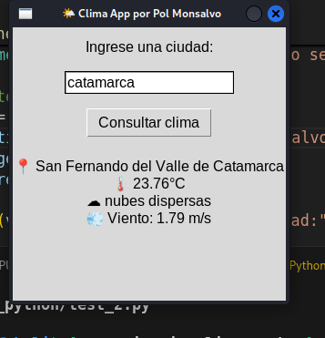

# clima_python

Aplicación en Python para consultar el pronóstico del tiempo usando la API de OpenWeatherMap.

---

## 💡 Descripción
Este proyecto comienza con un simple prompt a ChatGPT:
> "Hola Chat, quiero que me des un código en Python para ver el pronóstico del tiempo."

El objetivo fue crear una app funcional, profesional y educativa, integrando buenas prácticas de desarrollo Python.

---

## 🧠 Requisitos

1. Tener Python instalado.
2. Instalar la librería `requests`:
```bash
pip install requests
```
3. Crear una cuenta gratuita en [OpenWeatherMap](https://home.openweathermap.org/users/sign_up) y obtener tu API Key.

---

## 🦯 Obtener tu API Key

1. Registrate en [OpenWeatherMap](https://home.openweathermap.org).
2. Ir a "API keys" o directamente a este [link](https://home.openweathermap.org/api_keys).
3. Copiar tu clave y usarla en tu script:
```python
mi_api_key = "AQUI_TU_API_KEY"
```

### 🔐 Tip: Usar archivo `.env` para mayor seguridad

1. Crear archivo `.env`:
```env
API_KEY=tu_api_key
```
2. Instalar `python-dotenv`:
```bash
pip install python-dotenv
```
3. Modificar tu código para usar la variable de entorno.

---

## 📅 Ejecutar la app

1. Correr directamente el script:
```bash
python test.py
```
2. Si usás entorno virtual (recomendado):
```bash
python -m venv venv
source venv/bin/activate      # Linux/macOS
venv\Scripts\activate         # Windows
pip install requests
python test.py
```

---

## 🚀 Validación rápida de API
Pegá esto en el navegador:
```
http://api.openweathermap.org/data/2.5/weather?q=Buenos%20Aires&appid=TU_API_KEY&units=metric&lang=es
```
Deberías ver un JSON con el clima actual.

---

## 🔒 .gitignore recomendado
```gitignore
# Entorno virtual
venv/
.env
__pycache__/
*.py[cod]
*.log
.idea/
.vscode/
tests/__pycache__/
```

---

## 📆 Archivo requirements.txt
Para instalar dependencias:
```bash
pip freeze > requirements.txt
pip install -r requirements.txt
```

Ejemplo de contenido:
```text
requests==2.31.0
python-dotenv==1.1.0
```

---

## 🔧 Solución de errores comunes

- `KeyError`: revisar si la API devolvió correctamente los datos.
- `ModuleNotFoundError: No module named '_tkinter'`: instalar soporte con:
```bash
sudo apt install python3-tk
```

---

## 🚀 Mejoras implementadas

### 📅 GUI con Tkinter
- Interfaz visual en Python.
- Permite ingresar la ciudad y ver el clima.
- Muestra datos con iconos y colores amigables.



### 🌍 Mapa interactivo con Folium
- Se abre un mapa en el navegador con la ubicación de la ciudad consultada.
- Requiere instalar:
```bash
pip install folium
```

### 📧 Enviar clima por correo (opcional)
- Usar `smtplib` o `yagmail`.
- Ideal para automatizar con `cron`.

---

## 🔍 Ideas futuras

| Mejora | Descripción | Dificultad |
|--------|-------------|------------|
| 🌍 Mostrar mapa con ubicación | Con `folium` y `webbrowser` | Media |
| 📧 Enviar clima por email diario | Automatizado con `cron` | Media |
| 🔦 Modo oscuro / claro | Estilos visuales en Tkinter | Fácil |
| 🌞 Iconos reales del clima | Imágenes según el estado | Media |
| 🌐 Versión web con Flask | Mini app web con OpenWeather | Alta |

---

## 👨‍💼 Sobre el autor
Desarrollado por Pablo Matías Monsavo, como parte de un aprendizaje integral en Python, APIs, y desarrollo de software profesional.

---

## 📖 Licencia
Este proyecto está bajo la licencia MIT.

---

> 🚀 ¡Gracias por visitar este proyecto! Si te gustó, no dudes en dejar una estrella en el repo ✨

