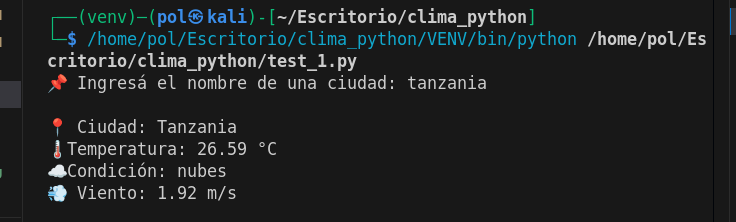
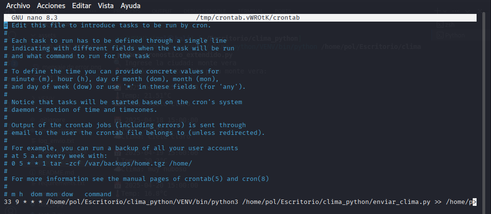
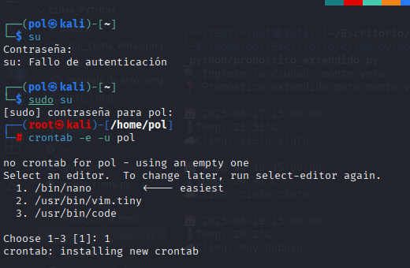
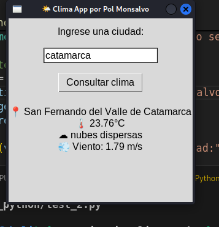
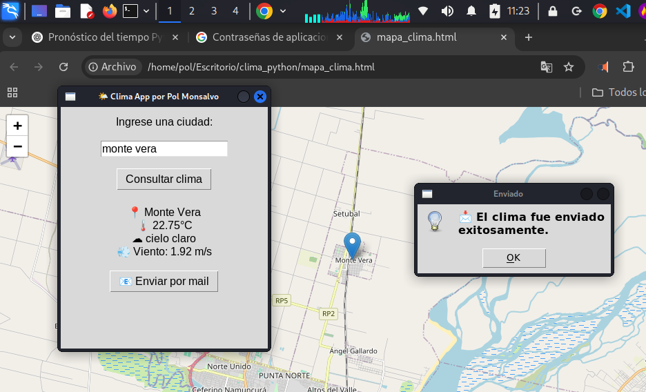
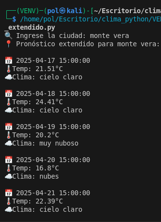
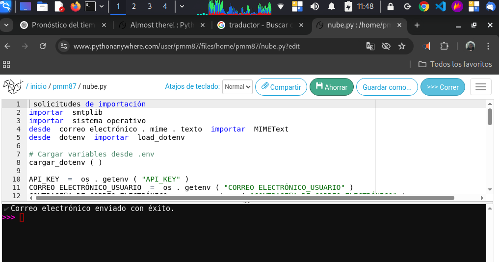
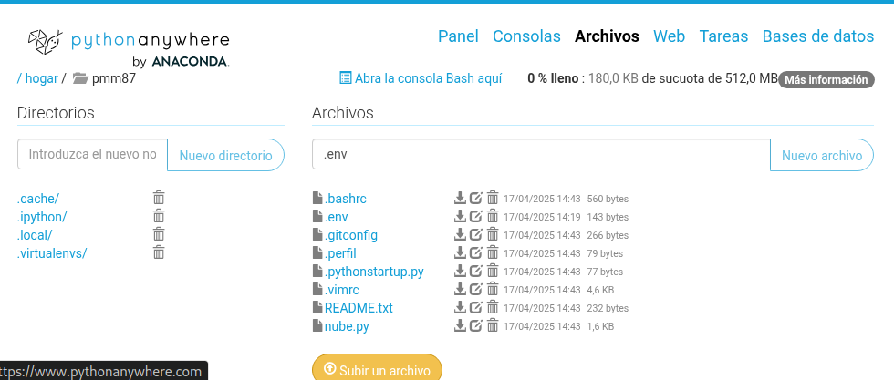
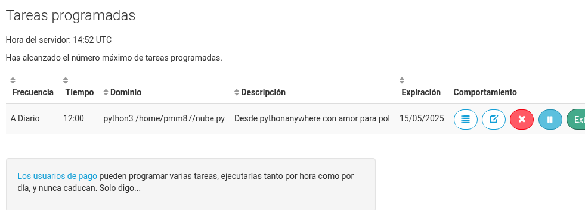
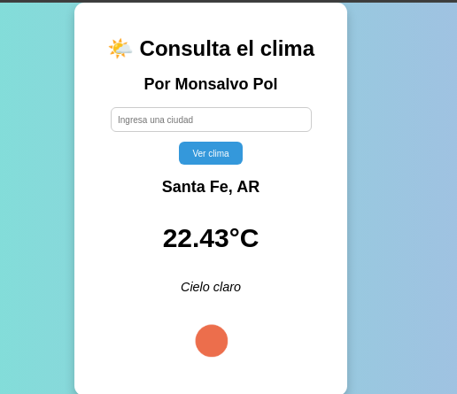

# ⛅ Aplicación de Clima con Python + Email + Cron + GUI
☁️ App Clima + Email Automático con Python
⚡ Este proyecto nace de la pasión por aprender, una computadora reciclada y la voluntad de crear soluciones reales con Python. Se trata de una aplicación escrita en Python que permite obtener el clima actual y el pronóstico extendido, mostrarlo en una interfaz gráfica, enviarlo por correo electrónico y automatizar el envío con `cron`.

## 🔧 Requisitos

- Python 3.x
- API Key de [OpenWeatherMap](https://openweathermap.org/api)
- Librerías: `requests`, `tkinter`, `smtplib`, `email`, `schedule`
- Entorno de desarrollo (Visual Studio Code, PyCharm, etc.)

---

## 🌍 Versión inicial desde la terminal

La primera versión del script imprimía el clima directamente en consola.

### ✅ Resultado desde la terminal

---

## 💌 Envío por correo electrónico

Luego se incorporó el módulo `smtplib` para enviar el pronóstico al correo del usuario.

### 🛠️ Configuración de email

### 📥 Email recibido en Thunderbird

---

## 🕒 Automatización con CRON en Linux

La siguiente mejora fue automatizar el script usando tareas programadas (`cron`), permitiendo el envío diario del clima sin intervención manual.

### 💻 Vista desde terminal: configuración de cron

### 🔐 Uso de sudo para configurar cron

---

## 🖥️ Interfaz gráfica con Tkinter

Se implementó una GUI usando `tkinter` para hacer la app más accesible a usuarios sin experiencia con la terminal.

### 🎨 Interfaz gráfica

### 🌦️ Clima y envío desde GUI

### 🔭 Pronóstico extendido

---

## 🐞 Manejo de errores

Se implementó una ventana de error que avisa cuando la API Key es inválida o no hay conexión a internet.

### ⚠️ Error de conexión o API inválida

---

## 🌐 Despliegue en PythonAnywhere

Finalmente, la app fue subida a [PythonAnywhere](https://www.pythonanywhere.com/) para acceder al pronóstico desde cualquier navegador.

### 🧭 Inicio en PythonAnywhere

### 📤 Subida de archivos

### 🛠️ Configuración de entorno y rutas

---

## 💡 Ideas futuras

- Guardar historial en archivo o base de datos
- Mejoras estéticas con `customtkinter` o `PyQt`
- Notificaciones automáticas vía Telegram
- Agregado de reconocimiento por voz

---

## 🙌 Autor

🙌 Autor: Pablo Matías Monsalvo 
Este proyecto fue desarrollado en modo autodidacta, con la ayuda de ChatGPT, usando una notebook de bajos recursos rescatada de una caja de chatarra y revivida con Kali Linux.

Forma parte de un recorrido de aprendizaje en programación y automatización con Python, complementado con cursos de Kaggle y Alura LATAM.

También se desarrollaron otros proyectos de Data Science en Python, siguiendo desafíos de Kaggle y guías de aprendizaje en español, siempre con el objetivo de crecer y generar nuevas oportunidades.

---

## 🧾 Licencia

MIT License

# Mejoras con Flask

## Más mejora...

*Seguir con las mejoras
**Agregarle más gráfico profesionales

